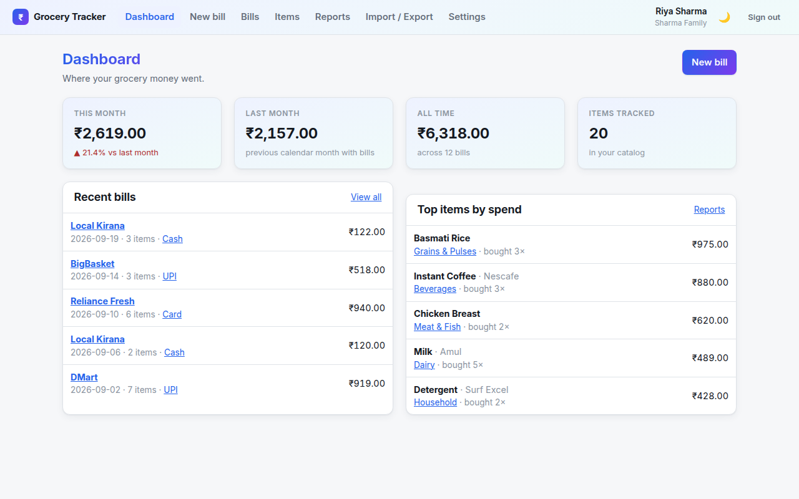
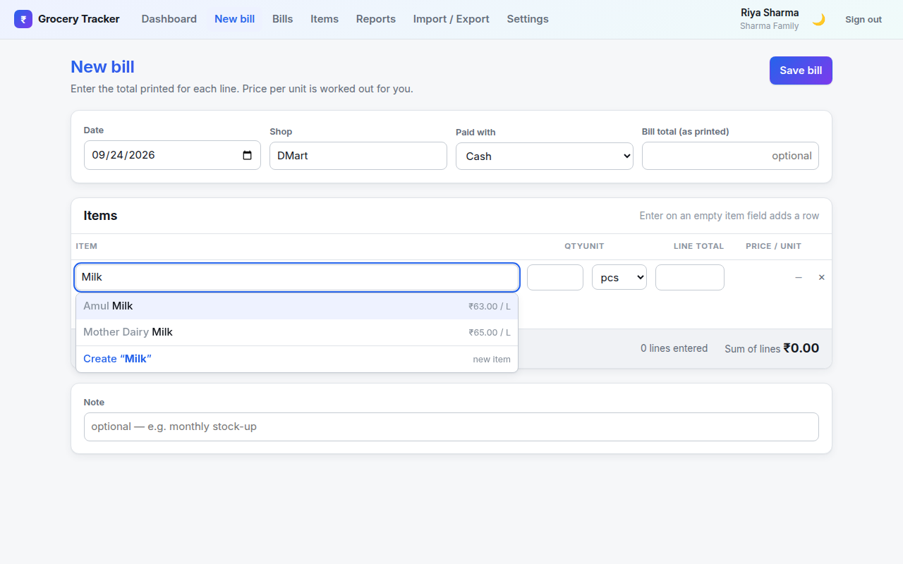
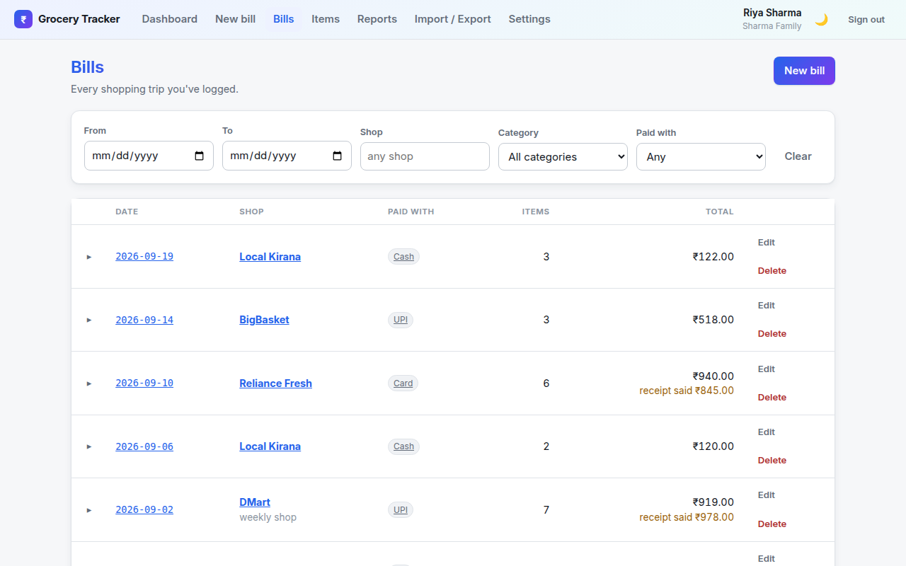
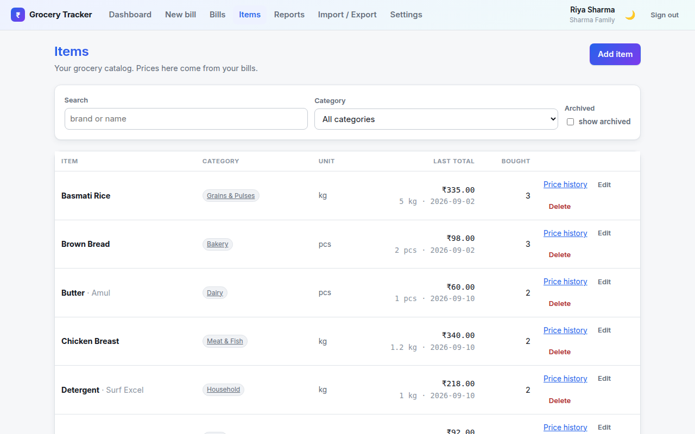
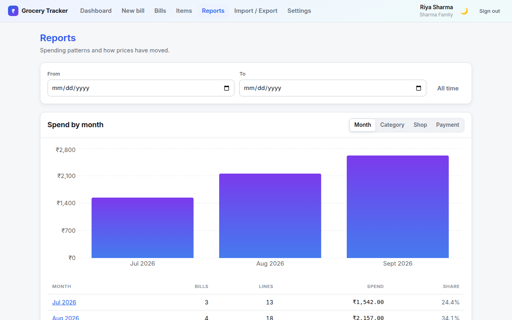
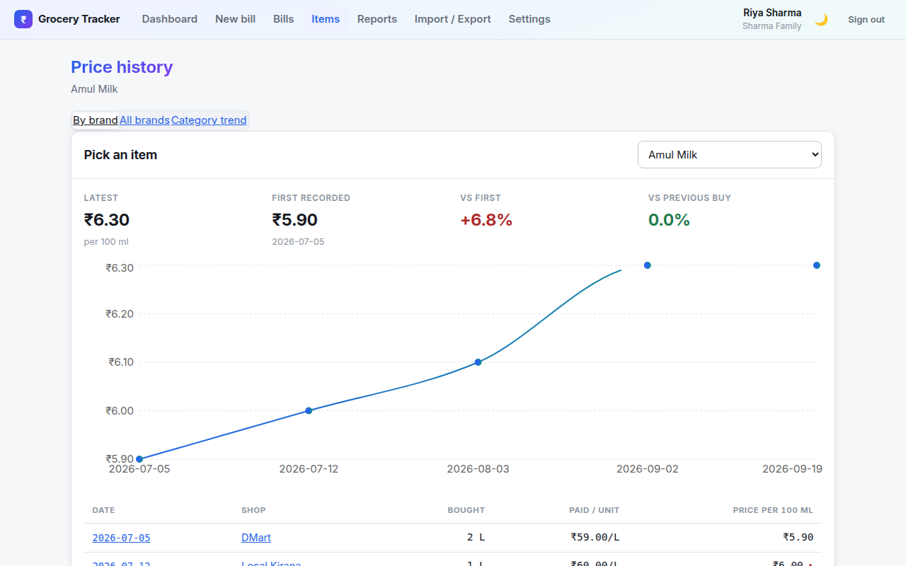
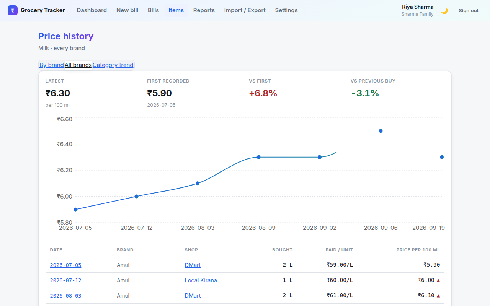
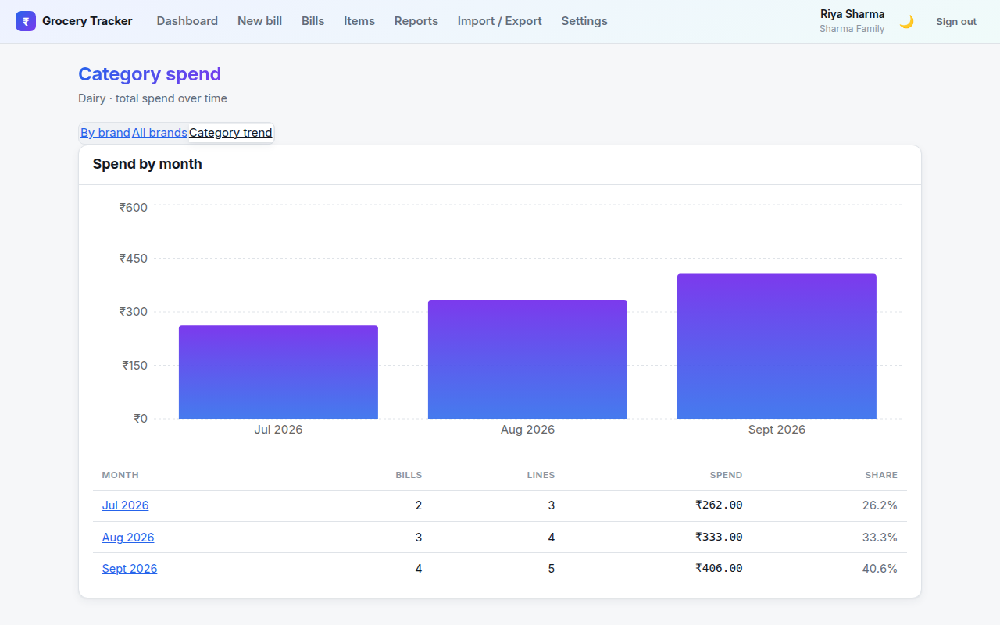
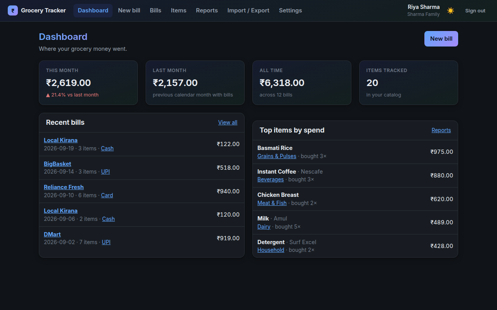

# Grocery Tracker

Log each day's grocery bill, keep a catalog of what you buy, and see where the money goes.



- **Item catalog** — brand, name, category, usual unit. Items are created inline while
  entering a bill, so entry never has to stop.
- **Bill entry** — date, shop, payment method and the printed total, plus one line per
  item (quantity, unit, price per unit). Line totals are computed, and the item field
  autocompletes against your existing catalog.
- **Reports** — spend by month / category / shop / payment method, and top items by spend
  or quantity.
- **Price history, three ways** — one brand's price trend, that item's name merged across
  every brand, and a whole category's total spend over time, all cross-linked.
- **Click-to-filter everywhere** — category badges, shop names, payment-method pills and
  month labels are links that jump straight into a filtered view.
- **CSV import & export** — round-trippable, with a dry-run preview before anything is written.
- **Households** — several people share one dataset; each account signs in separately.
- **Light and dark themes**, following the system by default.

Currency is INR (₹) and units are metric: kg, g, L, ml, pcs, pack, dozen.

## Screenshots

<table>
  <tr>
    <td width="50%">
      
      <br /><sub>Entering a bill — item search shows the last price paid under each brand.</sub>
    </td>
    <td width="50%">
      
      <br /><sub>Bills, filterable by date, shop, category and payment method.</sub>
    </td>
  </tr>
  <tr>
    <td width="50%">
      
      <br /><sub>The item catalog, with each item's last price and purchase count.</sub>
    </td>
    <td width="50%">
      
      <br /><sub>Spend by month, category, shop or payment method.</sub>
    </td>
  </tr>
  <tr>
    <td width="50%">
      
      <br /><sub>Price history for one item and brand, quoted per 100 g/ml/pc.</sub>
    </td>
    <td width="50%">
      
      <br /><sub>The same item's price merged across every brand it's sold under.</sub>
    </td>
  </tr>
  <tr>
    <td width="50%">
      
      <br /><sub>A category's total spend over time — cross-linked from either price view.</sub>
    </td>
    <td width="50%">
      
      <br /><sub>Dark mode, following the system by default.</sub>
    </td>
  </tr>
</table>

## Requirements

Node **24 or newer**. The server runs TypeScript directly through Node's native type
stripping, so there is no build step for the server itself (only the client goes through
`vite build`). Data is stored via [Turso](https://turso.tech) (libSQL) — see
[Data and deployment](#data-and-deployment) below; local development needs no account or
network access at all.

## Running it

```bash
npm install
```

```bash
npm run dev
```

That starts the API on `http://localhost:5174` and the Vite dev server on
`http://localhost:5173`. Open the second one. Both bind to all interfaces, so the app is
reachable from a phone on the same wifi at `http://<your-machine-ip>:5173`.

Copy `.env.example` to `.env` to change the port or point at a real Turso database
instead of the local file.

For a single-process production run, build the client first — the server then serves it
from the same origin:

```bash
npm run build && npm start
```

## First use

Sign up to create a household. That seeds twelve editable categories (Produce, Dairy,
Bakery, …) and signs you in. Add other people from **Settings → Add member**; everyone in
a household sees and edits the same items, bills and reports.

## How prices are compared

The **line total** is what's entered and stored — it's what a receipt actually prints.
Price per unit is derived from it (`total ÷ quantity`, rounded) purely for display and for
prefilling your next purchase of the same item; it's never itself editable, since a
receipt rarely prints a clean per-unit rate and dividing one back out can land on a paisa
the total doesn't match (a 200 g pack at ₹109 flat has no exact per-gram price).

Every line is also stored in a base unit (mass → g, volume → ml, count → pcs), which is
what makes price history trustworthy: 1 kg at ₹60 and 500 g at ₹30 are the same rate, so
they land on the same curve. Price history is quoted per 100 g, per 100 ml or per piece.

A category mixes incompatible units (kg, L, pcs), so there's no single per-unit rate to
chart there — a category's trend is its total spend over time instead, not a price.

Money is stored as integer paise throughout — never as a float.

## CSV format

```
bill_date, shop, payment_method, brand, item_name, category, quantity, unit, unit_price, line_total, bill_total, note
```

Required: `bill_date` (YYYY-MM-DD), `shop`, `item_name`, `quantity`, `unit`. Either
`line_total` or `unit_price` must be present; `line_total` is used as-is when given, and
`unit_price` is only a fallback, multiplied out to a total. `bill_total` is the printed
receipt total, repeated on every row of the same bill. Rows sharing a date, shop and
payment method become one bill.

Import always shows a preview first — how many bills and lines, which items, categories and
shops are new, and which rows are invalid. Nothing is written until you confirm, and
invalid rows are skipped rather than failing the whole file. An export can always be
re-imported without creating duplicates.

## Layout

```
shared/     units, money, CSV and zod schemas — used by both server and client
server/     Express API; routes/ per resource, lib/ for the logic they share
  db/       Drizzle ORM: connection, schema.ts (source of truth), category seed
client/     React app; pages/ per screen, components/ for shared UI
tests/      vitest — unit tests for shared/, integration tests against the real API
docs/       screenshots used in this README
```

## Commands

```bash
npm test
```

```bash
npm run typecheck
```

`npm run build` builds the client into `dist/client`.

## Data and deployment

Data is stored via **Turso** (libSQL — a SQLite-compatible, network-hosted database with
a durable free tier). Locally, with no `TURSO_DATABASE_URL` set, the app falls back to a
plain embedded file at `data/grocery.db` — no account, no network, `npm install && npm
run dev` just works. Only a deployed instance needs real Turso credentials.

This matters specifically because of where this app is meant to run: Render's free tier
has **no persistent disk** — every deploy and restart wipes the container filesystem, so
a locally-stored SQLite file would lose all its data on the next deploy. A network
database sidesteps that entirely.

Run behind TLS if you expose it beyond your own network — session cookies are marked
`secure` when `NODE_ENV=production`, so they won't be sent over plain HTTP at all.

### Deploying on Render

This deploys as a plain Node web service (no Docker) — either via the included
`render.yaml` Blueprint or by hand:

1. Create a [Turso](https://turso.tech) account and database, and note its connection
   URL (`libsql://<name>-<org>.turso.io`) and an auth token for it.
2. Push this repo to GitHub (or GitLab).
3. **Blueprint path**: Render dashboard → **New → Blueprint**, pick the repo. Render
   reads `render.yaml` and proposes a free-tier Node web service. Confirm, then set
   `TURSO_DATABASE_URL` and `TURSO_AUTH_TOKEN` in the service's **Environment** tab (the
   Blueprint marks them `sync: false` deliberately, so they're never committed to the
   repo — you set them once in the dashboard).
   **Manual path**: **New → Web Service** → connect the repo → environment **Node** →
   Build Command `npm install && npm run build` → Start Command `npm start` → set
   `TURSO_DATABASE_URL`/`TURSO_AUTH_TOKEN` → Health Check Path `/api/health`. `PORT` is
   injected by Render automatically.
4. Deploy, then open the `*.onrender.com` URL and sign up — that creates your household.
5. Confirm persistence actually works: add a bill, trigger a redeploy (push a commit, or
   redeploy manually from the dashboard), and check the bill survived.
